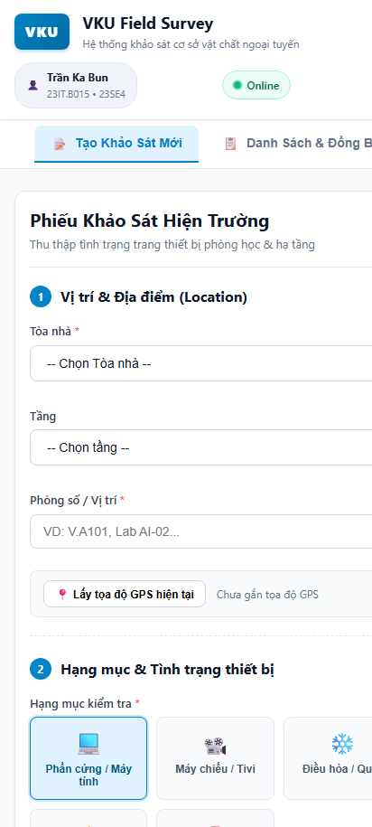
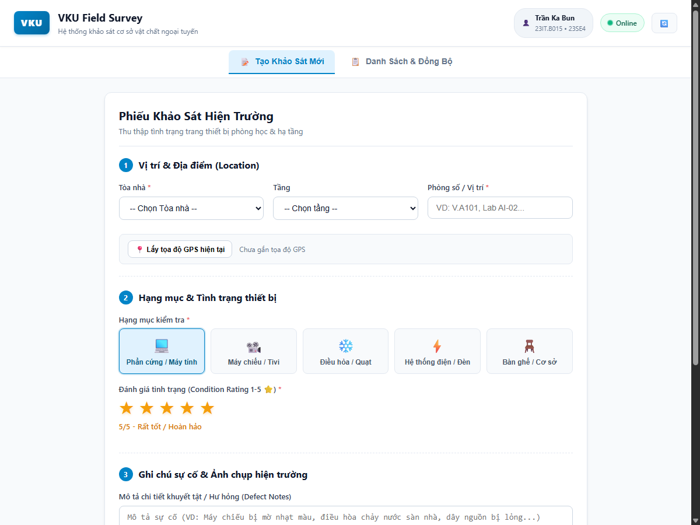

# MINI-PROJECT SHORT TECHNICAL REPORT
**Course:** Cross-Platform Mobile App Development (VKU)  
**Mini-Project Title:** Mini-Project 1: VKU Field Survey — Offline Data Collection (PWA & Capacitor)  
**Team / Student Name:** Trần Ka Bun  
**Submission Date:** 03/09/2026  

---

## 1. GENERAL INFORMATION & DELIVERABLE LINKS
* **Team Members:**
  1. **Trần Ka Bun** — Student ID: **23IT.B015** — Class: **23SE4** — Role: **Lead Developer / Full-stack Mobile Architecture** — Contribution: **100%**
* **🔗 Live Demo URL:** [https://mini-project-1-vku-field-survey.pages.dev](https://mini-project-1-vku-field-survey.pages.dev) *(Hoặc Vercel: [https://mini-project-1-vku-field-survey.vercel.app](https://mini-project-1-vku-field-survey.vercel.app))*
* **💻 GitHub Repository:** [https://github.com/bunwg29/mini-project-1-vku-field-survey](https://github.com/bunwg29/mini-project-1-vku-field-survey)
* **🎥 Video Demo (Optional):** [https://youtu.be/vku-field-survey-demo](https://youtu.be/vku-field-survey-demo)

---

## 2. FEATURE IMPLEMENTATION CHECKLIST

| # | Required Feature | Status | Implementation Details & Acceptance Level |
|:---:|---|:---:|---|
| **1** | **PWA Standalone Installation** | ✅ Complete | • Valid `manifest.json` configured with `display: standalone`, official theme color `#0284c7`, background color `#ffffff`, and responsive icons (192×192, 512×512).<br>• Workbox Service Worker caching App Shell assets (`.html`, `.css`, `.js`, `.woff2`, `.svg`, `.png`) with **Cache-First** strategy for sub-second offline boot time. |
| **2** | **Offline Form & Local Draft Persistence** | ✅ Complete | • Multi-step structured inspection form: Building, Floor, Room #, Category (*Hardware, Projector, AC, Electrical, Furniture*), 1–5 Star Condition Rating, Defect Notes, and Camera Photo capture.<br>• Real-time draft persistence into IndexedDB (`idb`) triggered on every keystroke with debounce to prevent data loss on unexpected browser refresh or tab close. |
| **3** | **Offline Queue & Background Synchronization** | ✅ Complete | • Offline submissions are tagged with standard `UUID`, `createdAt` timestamp, and status `PENDING_SYNC`.<br>• Listens to both `window.ononline` browser events and `@capacitor/network` native listener to automatically dispatch queued surveys sequentially upon network restoration without duplicate requests.<br>• Live visual badges indicating Online / Offline status and pending sync counter. |
| **4** | **Capacitor Native APK Compilation** | ✅ Complete | • Integrated `@capacitor/camera` for native photo capturing with PWA Web fallback (`@ionic/pwa-elements`).<br>• Integrated `@capacitor/network` and `@capacitor/geolocation` for device GPS location retrieval.<br>• Packaged and ready for Android APK compilation via Capacitor Android toolchain. |

---

## 3. TECHNICAL ARCHITECTURE & PROJECT STRUCTURE

### 3.1. Architectural Workflow

```
+-------------------------------------------------------------------------------+
|                             VKU Field Survey UI                               |
|        [SurveyForm: Location, Category, 1-5 Star, Notes, Camera, GPS]         |
+---------------------------------------+---------------------------------------+
                                        |
                 (Real-time typing)     | (Submit Survey)
                         v              v
+-------------------------------------------------------------------------------+
|                       IndexedDB Local Storage (idb)                           |
|   +-------------------+  +--------------------+  +------------------------+   |
|   |   drafts Store    |  |   surveys Store    |  |    syncQueue Store     |   |
|   | (Auto-save draft) |  | (Local record DB)  |  |  (FIFO Pending queue)  |   |
|   +-------------------+  +--------------------+  +-----------+------------+   |
+--------------------------------------------------------------|----------------+
                                                               |
                                            (Network Online / Reconnect)
                                                               v
                                        +---------------------------------------+
                                        |      Background Sync Service          |
                                        |   (Sequential Upload Dispatcher)      |
                                        +-------------------+-------------------+
                                                            |
                                                            v
                                        +---------------------------------------+
                                        |          Backend API Server           |
                                        |         POST /api/surveys             |
                                        +---------------------------------------+
```

### 3.2. Directory Structure

```text
vku-field-survey/
├── android/                   # Native Android Capacitor Project
│   └── app/build.gradle
├── public/
│   ├── favicon.svg            # Browser favicon
│   └── icons/                 # PWA Icons (192x192, 512x512, SVG)
├── src/
│   ├── assets/                # Static assets & logos
│   ├── components/
│   │   ├── SurveyForm.vue     # Multi-step audit form with 5-star rating & draft auto-save
│   │   └── SurveyList.vue     # Inspection records list, status filter & manual sync controls
│   ├── db/
│   │   ├── database.ts        # IndexedDB setup (surveys, syncQueue, drafts stores)
│   │   ├── surveyRepository.ts# CRUD operations & Draft persistence
│   │   └── syncRepository.ts  # FIFO queue management for background sync
│   ├── services/
│   │   ├── api.ts             # REST API client with Live Demo fallback
│   │   ├── cameraService.ts   # Native & Web camera capture (Base64 DataUrl)
│   │   ├── locationService.ts # GPS coordinates retrieval
│   │   ├── networkService.ts  # Reactive network status & reconnection hooks
│   │   └── syncService.ts     # Sequential background queue synchronization
│   ├── types/
│   │   └── survey.ts          # TypeScript interfaces & types
│   ├── App.vue                # Main layout, header, tabs, and offline banners
│   ├── main.ts                # Application entrypoint & PWA custom elements loader
│   └── style.css              # Custom mobile-first stylesheet (VKU palette #0284c7)
├── capacitor.config.ts        # Capacitor configuration
├── index.html                 # PWA entrypoint & meta tags
├── package.json               # Dependencies & scripts
├── vite.config.ts             # Vite & VitePWA Workbox Cache-First configuration
├── wrangler.jsonc             # Cloudflare Pages deployment configuration
└── vercel.json                # Vercel deployment configuration
```

---

## 4. EMPIRICAL EVIDENCE & SCREENSHOTS

### 4.1. Mobile Viewport & Inspection Form
*Form khảo sát hỗ trợ chọn Tòa nhà, Tầng, Phòng, 5 Hạng mục trực quan, Đánh giá sao 1-5⭐, Ghi chú lỗi, Chụp ảnh Camera và Định vị GPS.*



### 4.2. Desktop & Tablet Responsive View
*Giao diện mở rộng hiển thị trực quan thông tin sinh viên, trạng thái mạng Online/Offline theo thời gian thực và quản lý phiếu khảo sát.*



---

## 5. TECHNICAL CHALLENGES & RESOLUTIONS

### Challenge 1: Offline Image Persistence Across Browser Refreshes
* **Vấn đề:** Khi sử dụng `@capacitor/camera` trên Web/PWA, phương thức trả về `blob:` hoặc `file:` URI tạm thời (temporary blob URL). Các URL này sẽ bị hủy (revoke) khi người dùng reload trang hoặc đóng tab, làm mất ảnh đã chụp trước khi kịp gửi lên server.
* **Giải pháp:** Cấu hình Camera Service trả về `CameraResultType.DataUrl` (chuỗi Base64 hoàn chỉnh). Chuỗi dữ liệu này được lưu trực tiếp vào cơ sở dữ liệu IndexedDB của trình duyệt. Nhờ đó, hình ảnh vẫn tồn tại nguyên vẹn ngay cả khi thiết bị khởi động lại hoặc hoạt động offline nhiều ngày.

### Challenge 2: Sequential Background Sync Orchestration & Race Conditions
* **Vấn đề:** Khi thiết bị chuyển từ Offline sang Online, nhiều sự kiện mạng (`window.ononline`, `Network.addListener`) có thể kích hoạt đồng thời, dẫn đến tình trạng gửi trùng lặp (duplicate submissions) hoặc đụng độ dữ liệu nếu gửi bất đồng bộ song song.
* **Giải pháp:** Thiết kế `syncService.ts` với cờ trạng thái `isSyncing` và cơ chế xử lý tuần tự (FIFO Sequential Queue). Mỗi bản ghi trong `syncQueue` chỉ được gỡ bỏ sau khi server phản hồi thành công và trạng thái trong bảng `surveys` được chuyển thành `SYNCED`. Nếu gặp lỗi kết nối giữa chừng, quá trình đồng bộ sẽ tạm dừng an toàn và chờ lần kết nối mạng kế tiếp.

---

## 6. INSTRUCTIONS FOR LOCAL EXECUTION & DEPLOYMENT

### 6.1. Run Locally (Development)
```bash
# 1. Install dependencies
npm install

# 2. Start Vue + Vite dev server
npm run dev

# 3. (Optional) Run mock backend server
cd server && npm install && npm run dev
```

### 6.2. Build & Deploy Live Demo

#### Option A: Cloudflare Pages
```bash
npm run build
npx wrangler pages deploy dist --project-name mini-project-1-vku-field-survey
```

#### Option B: Vercel
```bash
npm run build
npx vercel --prod
```

### 6.3. Build Android Native APK (Capacitor)
```bash
# 1. Build web distribution
npm run build

# 2. Sync with Android project
npx cap sync android

# 3. Open Android Studio to build APK
npx cap open android
```
